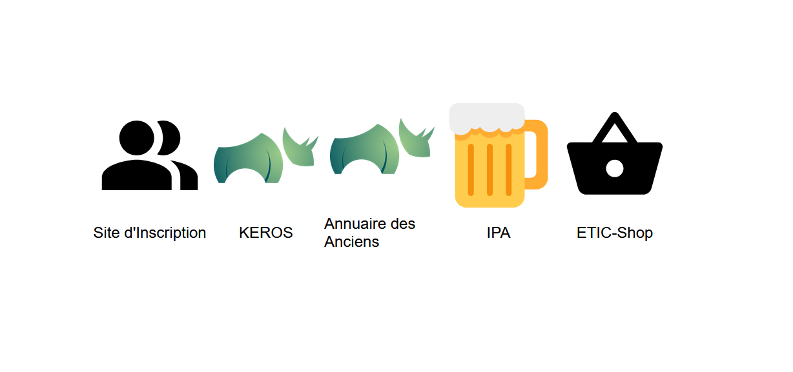

# Sites
> A webpage to aggregate ETIC's websites.

Sites is a webpage that serves as a central hub to access ETIC's differents websites.
[Link](https://sites.etic-insa.com/).

## Usage

### Normal usage

https://sites.etic-insa.com/{path}. For example :
- [IPA : https://sites.etic-insa.com/ipa](https://sites.etic-insa.com/ipa)
- [ETIC Shop : https://sites.etic-insa.com/shop](https://sites.etic-insa.com/shop)

### Adding a new redirection

There are two ways to add a redirection, by editing the Config file on Github or by editing an assigned Google Sheets.
Adding the redirection directly into the config file will make the redirection much faster.

The `iframe` attribute controls whether the page will redirect to the target website or open the target inside of an iframe. Set it to TRUE (or VRAI in the Sheets) if you want the iframe option. Note that in the case of an app made with Google Apps Script, you need to allow it to be opened inside of an iframe [More info](https://developers.google.com/apps-script/reference/html/html-output#setXFrameOptionsMode(XFrameOptionsMode)).

#### Option 1 : Via Google Sheets

1. Edit the assigned spreadsheet [Edit spreadsheet](https://docs.google.com/spreadsheets/d/1Zsp2m42jozEn5IIjhzrrxWNrF6KXk2i9FA07lPZEG8A/edit?usp=sharing)
2. Add the new redirection to the sheet.
3. Changes will be automatically saved
5. Test that the site has been correctly updated, it might take 5-10 minutes for the spreadsheet to be published. You might need to clear the browser cache of the page to view the new version, Ctrl + Shift + R in most browsers. [Link](https://sites.etic-insa.com/).

#### Option 2 : On Github

1. Edit the `config.js` file on the master branch. The simplest way to do this is to edit the file directly on Github. Note that you might need writing rights on the repository to do this. [Edit config.js](https://github.com/ETICINSATechnologies/Sites/edit/main/config.js)
2. Add the new redirection to the `REDIRECTS` table. Make sure to respect javascript syntax ;) Syntax errors will cause the site to break (just follow the existing as example and it should be fine).

3. Save the changes by clicking on 'Commit changes'.
4. Test that the site has been correctly updated. You might need to clear the browser cache of the page to view the new version, Ctrl + Shift + R in most browsers. [Link](https://sites.etic-insa.com/).

## Meta

Sadsitha Lokuge

[https://github.com/slokuge/](https://github.com/slokuge/)
